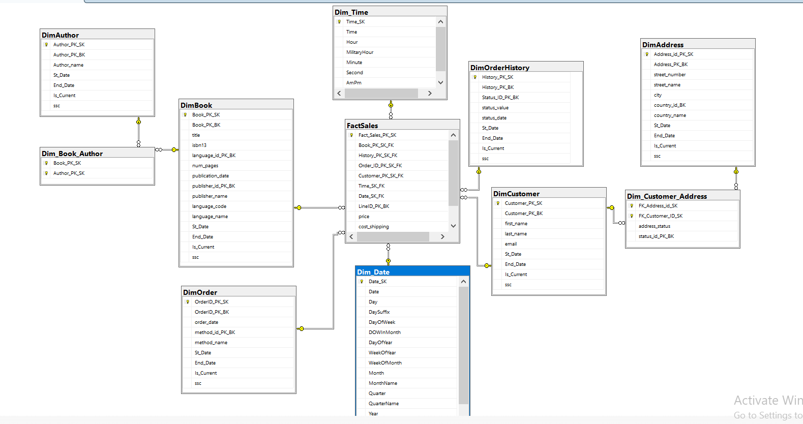
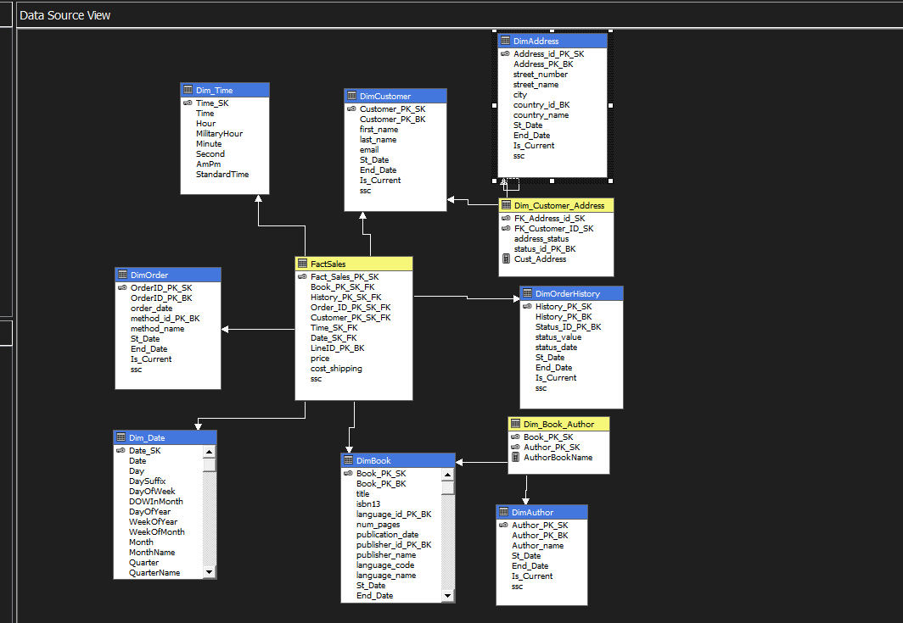
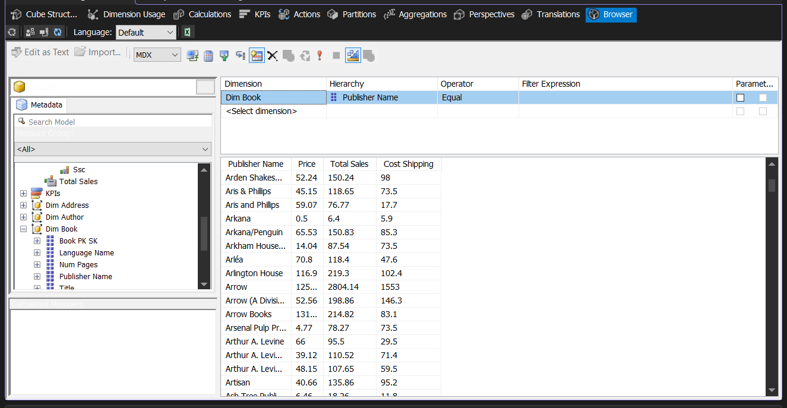

# Gravity Books Data Warehouse & OLAP Project

## Overview
End-to-end Data Engineering project that transforms a transactional bookstore database into a dimensional Data Warehouse and SSAS OLAP Cube for analytical reporting.

---

## Architecture
- Source: OLTP Bookstore Database  
- ETL: SSIS  
- Warehouse: SQL Server Star Schema  
- OLAP: SSAS Multidimensional Cube  

---

## Data Model

---

## ETL Pipeline
- Extracted data from OLTP source  
- Applied transformations and cleansing  
- Implemented surrogate keys & SCD handling  
- Loaded dimensional model into warehouse  

---

## OLAP Cube

### Cube Structure

### Analysis View

---

## Key Concepts
- Star Schema Design  
- Slowly Changing Dimensions (SCD)  
- Many-to-Many Relationships  
- MDX Calculations  

## Tech Stack
SQL Server • SSIS • SSAS • MDX
